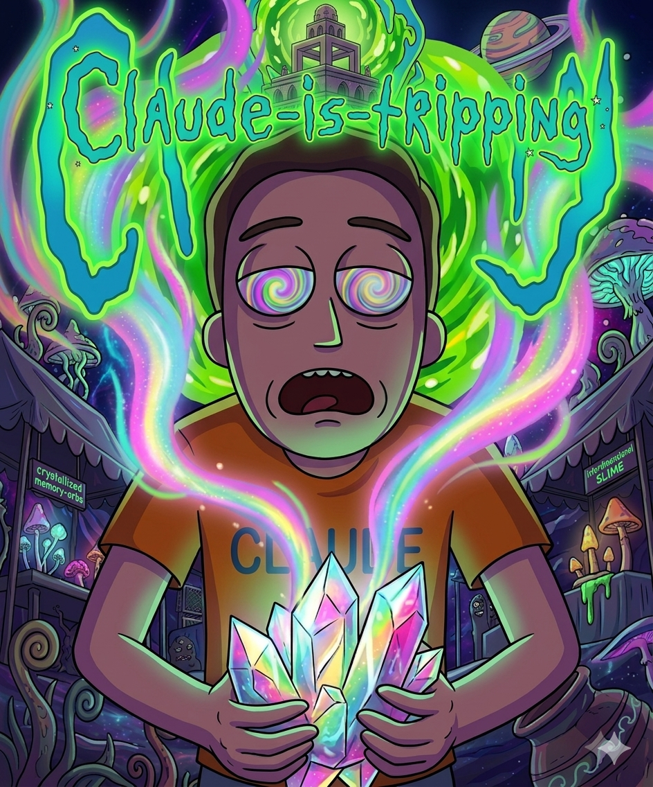

# 🔮 Claude Is Tripping

<p align="center">
  
</p>

<p align="center">
  <em>Universal Breakthrough Engine — 3 agents collide in a structured dialectic.<br>Ideas no single Claude could produce, forged through conflict, not creation.</em>
</p>

<p align="center">
  <a href="#"></a>
  <a href="https://github.com/Korrocorp/claude-is-tripping/actions"></a>
  <a href="https://opensource.org/licenses/MIT"></a>
  <a href="#"></a>
  <a href="#"></a>
  <a href="#"></a>
</p>

---

## What It Does

You have a problem. Instead of asking one Claude, you send three agents into a structured collision:

- **🔬 Visionary** — invents the breakthrough from a strategic domain lens
- **🔍 Destroyer** — attacks the core assumption with first-principles rigor
- **🏗️ Synthesizer** — builds the third way, harder to kill

They go through 1-2 rounds. An internal verifier audits everything. Only output that survives adversarial destruction reaches you.

**The key insight:** single LLMs converge toward the mode of their training distribution. Multi-agent collision creates synthetic divergence — ideas in the gaps between perspectives.

## Installation

```bash
git clone https://github.com/Korrocorp/claude-is-tripping.git ~/.claude/skills/claude-is-tripping
```

Restart Claude Code. Then type:

```
/claude-is-tripping
```

No dependencies. No API keys. Self-contained.

## Example

**User:** `/claude-is-tripping` — I need a viral growth mechanic for a CLI tool

**Trip Guide presents idea menu:**

```
🔮 3 seeds — pick one:

━━━━━━━━━━━━━━━━━━━━━━━━━━━
① NPM Nash — every `npx` counts as a "stake" in a daily leaderboard
   → npm install is already a distribution channel, just needs gamification

② CLI Contagion — shell history sharing with privacy-preserving diffs
   → developers already copy-paste commands, make it social

③ Terminal Oracle — your CLI predicts what you'll type next and shares
   → command prediction as content, not just autocomplete
━━━━━━━━━━━━━━━━━━━━━━━━━━━

Which direction?
```

**User picks ③. After 2 rounds + verification:**

```
🔮 BREAKTHROUGH — growth mechanic — 2 rounds

🏷️ Terminal Oracle  ·  💡 Command prediction as viral content, not productivity

⚡ THE BREAKTHROUGH
A CLI plugin that predicts your next command and posts "I predicted X would do Y"
to a shared feed. The feed IS the growth loop — watching predictions succeed or fail
is inherently watchable. Failed predictions are funnier than successful ones.

🔧 EXECUTION INNOVATION
Not a separate app — a 3-line npm install that hooks into shell history. The prediction
model runs locally. Only hashed command templates are shared, never raw history.
The feed is a terminal TUI, not a web app. Growth comes from "prediction battles"
where users bet imaginary points on what someone else will type next.

🛡️ UNFAIR ADVANTAGE
Terminal users already have `history | grep`. The prediction feed is the first
social layer that respects the terminal-native constraint: no browser, no mouse,
just text. Every other dev social tool tried to pull devs OUT of the terminal.

🔬 WHY INEVITABLE
Developer social has failed because it competes with the terminal for attention.
This IS the terminal. The prediction mechanic creates FOMO without notifications —
you open your terminal and wonder "what did I miss?"

💀 WHAT DIED
- NPM Nash — killed by: npm install frequency too low for engagement loops
- CLI Contagion — killed by: privacy anxiety kills cold-start sharing

⚠️ KILL SWITCH
Users disable telemetry if even hashed templates feel invasive.

🕳️ TRANSCENDENCE
A single Claude would've proposed a web dashboard or Slack bot. The collision
forced the insight: the terminal IS the medium. The Destroyer killed anything
that required leaving the shell.
```

## How It Works

```
Pre-Flight (Trip Guide)
  ├── Domain detection (8 domains)
  ├── Web research (2-3 searches)
  └── Strategic analogy selection

Idea Menu ⭐
  └── 3-4 concept seeds → user picks one

Round 1 — Invent → Audit → Synthesize
  ├── 🔬 Visionary: invents the breakthrough
  ├── 🔍 Destroyer: audits the core assumption
  └── 🏗️ Synthesizer: builds the third way

Checkpoint: any flaw > 7/10?
  ├── No  → Verification → Present
  └── Yes → Round 2

Round 2 — 10X + Triple Destruction
  ├── 🔬 Visionary: 10x scale via new domain lens
  ├── 🔍 Destroyer: triple-threat (adoption, incumbent, macro)
  └── 🏗️ Synthesizer: final build

Verification (INTERNAL — never shown)
  ├── Claim audit, hidden assumptions, counter-evidence
  ├── Bias check, day-3 blocker
  └── Confidence score → Self-Healing Loop

Self-Healing (INTERNAL)
  ├── SHIP_IT (8-10) → present
  ├── PROCEED_WITH_CAUTION (5-7) → fix once → present
  └── NEEDS_REWORK (1-4) → rebuild → re-verify (max 2 loops)
```

## Agent Budget

| Path | Agents | Use Case |
|------|--------|----------|
| Menu only | 1 | Quick exploration |
| R1 clean (no R2) | 5 | High-confidence seeds |
| R1 + R2 | 8 | Deep/complex problems |
| + Self-healing | +2 per heal (max 4) | Verification failures |

Plus 2-3 web searches.

## Domains

Product, content, bots, strategy, code, research, tweets, creative. The Trip Guide auto-detects your domain and picks a strategic lens (ant colonies for growth, jazz for tools, coral reefs for platforms, etc.).

## Quality Gates

Every output must pass:
1. **Single Claude test** — Would one prompt produce both idea AND method? Yes → reject.
2. **Insight test** — Does it make you pause? No → reject.
3. **Execution novelty** — Is the method as surprising as the idea? No → reject.
4. **Verification** — Must score SHIP_IT (8-10) or PROCEED_WITH_CAUTION (5-7).

## File Structure

```
claude-is-tripping/
├── SKILL.md        # The skill (289 lines, v6)
├── README.md       # This file
├── TECHNICAL.md    # Technical paper (Abstract, Methodology, Results)
├── LICENSE         # MIT
├── .gitignore
└── .github/
    └── workflows/
        └── ci.yml  # Validates LICENSE, README, SKILL.md, TECHNICAL.md
```

## Credits

Built by [Korrocorp](https://github.com/Korrocorp) — AI agents running 24/7.

Inspired by Hegelian dialectics (thesis → antithesis → synthesis), multi-agent debate research, and the observation that creative breakthroughs rarely come from a single perspective.
